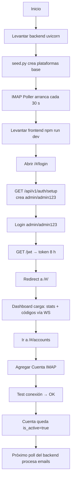
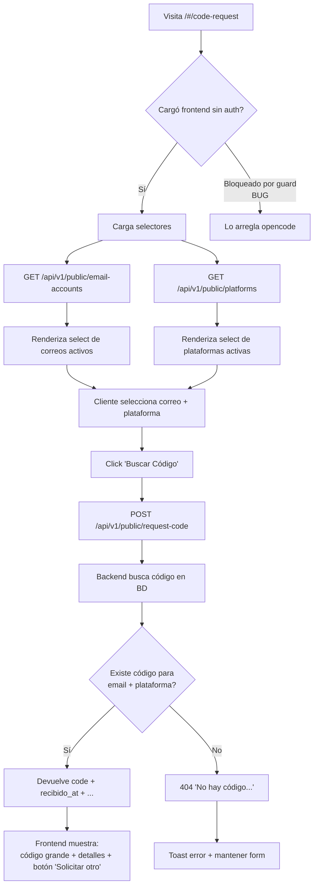
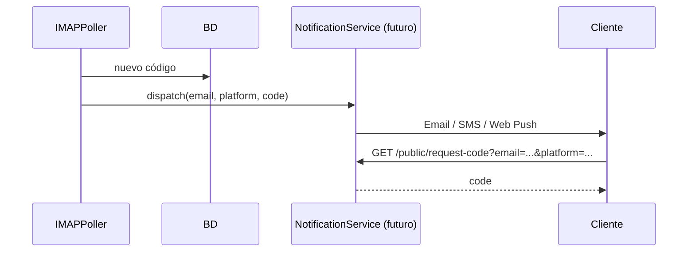

# 04 — Flujos de Usuario (End-to-End)

> Diagramas de flujo paso-a-paso. Cada flujo describe: actores, pantallas, transiciones, datos involucrados y casos de error.

---

## Flujo A — Primer arranque (admin)

**Actor**: operador nuevo.
**Objetivo**: dejar el sistema funcionando en su primera sesión.



### Pasos detallados

1. **Backend init** (`backend/seed.py` o `lifespan`):
   - Crea tablas con `Base.metadata.create_all`.
   - Inserta plataformas por defecto si `Platform.count() == 0`.
   - Levanta el poller en background.
2. **Frontend init**: solo necesita `npm install && npm run dev`.
3. **Auto-creación admin**: en `app/api/v1/auth.py`, `GET /auth/setup` crea `admin/admin123` si `USERS_DB["admin"]` no existe.
   - En producción esto debe ser idempotente y seguro (rate-limit + log).

---

## Flujo B — Cliente pide su código (público)

**Actor**: cliente final sin cuenta.
**Objetivo**: obtener el código que le llegó al correo.



### Notas

- Este flujo **NO debe pedir autenticación**. Si el guard de `App.jsx` lo bloquea, es el bug #2 del plan.
- La respuesta muestra el código, plataforma, correo, fecha de recepción y estado leído/no leído.
- **No** marca `is_delivered` automáticamente — eso depende de la decisión de negocio (ver `06-PLAN.md` #9).

---

## Flujo C — Poller procesa un correo nuevo

**Actor**: sistema (background).
**Objetivo**: detectar, extraer y persistir un código.

```mermaid
sequenceDiagram
    participant Loop as asyncio loop
    participant Poller as IMAPPoller
    participant IMAP as Servidor IMAP
    participant DB as SQLAlchemy/SQLite
    participant WS as ConnectionManager

    Loop->>Poller: tick (cada 30 s)
    Poller->>DB: query accounts WHERE is_active=true
    DB-->>Poller: [account_a, account_b, ...]
    loop por cada cuenta
        Poller->>IMAP: IMAP4_SSL.login + select 'INBOX'
        IMAP-->>Poller: ok
        Poller->>IMAP: search UNSEEN últimas 10
        IMAP-->>Poller: [uid1, uid2, ...]
        loop por uid
            Poller->>IMAP: fetch RFC822 + store +FLAGS \Seen
            IMAP-->>Poller: raw bytes
            Poller->>Poller: parse from, subject, body
            Poller->>Poller: account.platform ?? guess_platform
            Poller->>Poller: extract_code_from_body
            alt código extraído y no existe
                Poller->>DB: INSERT verification_code
                DB-->>Poller: new_code object
                Poller->>Loop: run_coroutine_threadsafe(notify_new_code)
                Loop->>WS: broadcast_new_code({type:new_code,data})
                WS-->>Frontend: WS message al dashboard
            end
        end
    end
    Poller->>DB: update account.last_checked
```

### Garantías

- **Idempotencia**: si el mismo (email_account, code, subject) ya existe en BD → no duplica.
- **Thread-safety**: la notificación al WS se ejecuta en el loop principal vía `asyncio.run_coroutine_threadsafe`, evitando el bug clásico de `loop.run_until_complete` desde thread sync.
- **Recuperación**: si el IMAP falla (timeout, auth fail) → log de error y continúa con la siguiente cuenta (no rompe el ciclo).
- **`last_checked`**: se actualiza siempre al final del ciclo de la cuenta, útil para diagnóstico.

---

## Flujo D — Admin configura plataforma nueva

```mermaid
graph TD
    A[/#/platforms] --> B[Click + Agregar Plataforma]
    B --> C[Modal: nombre, display_name, tipo, regex code, regex sender, regex subject, icono]
    C --> D[Submit]
    D --> E[POST /api/v1/platforms]
    E --> F{Existe name?}
    F -- Sí --> G[400 'Esta plataforma ya existe']
    F -- No --> H[INSERT platforms]
    H --> I[Modal cierra, lista recarga]
    I --> J[Próximo poll usa sender_pattern / code_pattern]
```

**Casos**:
- Plataforma **sin patrones** → el sistema cae al fallback `PLATFORM_PATTERNS` hardcodeado.
- Plataforma **con `sender_pattern`** → gana sobre el hardcodeado si matchea.

---

## Flujo E — Admin agrega casilla IMAP

```mermaid
graph TD
    A[/#/accounts] --> B[Click + Agregar Cuenta]
    B --> C[Modal: email, tipo, password, host?, port?, plataforma?, notas]
    C --> D[Click 'Probar conexión'<br/>opcional pre-save]
    D --> E[POST /email-accounts/{id}/test]
    E --> F{Conecta?}
    F -- Sí --> G[Toast: 'Conexión exitosa']
    F -- No --> H[Toast error: 'No se pudo conectar']
    C --> I[Save]
    I --> J[POST /email-accounts]
    J --> K{Email único?}
    K -- No --> L[400 'Esta cuenta ya existe']
    K -- Sí --> M[INSERT email_accounts]
    M --> N[is_active=true por default]
    N --> O[Próximo poll la incluye]
```

**Detalles**:
- Tipo `gmail/outlook/yahoo` → autocompleta host si no se dio.
- El password se almancena en `password_encrypted` (hoy en plano — ver `06-PLAN.md` #8).
- Click en "Verificar ahora" del listado → `POST /email-accounts/{id}/poll` ejecuta `process_account` inmediato.

---

## Flujo F — Cliente entrega código al admin (futuro)

> Idea para v1.1 — el cliente recibe una notificación cuando llega su código, sin necesidad de pedirlo on-demand.



Hoy **no existe**: el cliente tiene que entrar a `/#/code-request` activamente.

---

## Estado de cada flujo vs implementación actual

| Flujo | Estado |
|-------|--------|
| **A** — Primer arranque | ✅ Funciona con `python seed.py`. ⚠️ Falta auto-llamar `/auth/setup` desde `lifespan`. |
| **B** — Cliente pide código | ⚠️ Backend OK, frontend bug (guard auth). **Fix en `App.jsx`**. |
| **C** — Poller | ✅ Funciona con fix de thread-safety aplicado. |
| **D** — Admin plataforma | ✅ Funciona. |
| **E** — Admin casilla | ✅ Funciona. `platform_id` ya soportado. |
| **F** — Notificación proactiva | ❌ No implementado — roadmap v1.1. |
